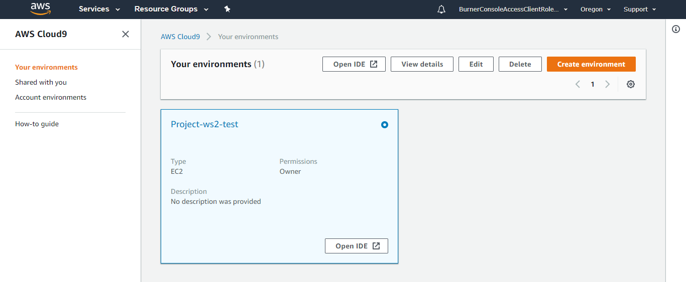

# CloudFormation Workshop
## Build your first web app with CloudFormation

## Summary
The goal of this workshop is to give users a hands on experience building CloudFormation templates. Ultimately, when all is done, users will have a working website on AWS. 

### Workshop Setup
Workshop accounts have already been created for you. Simply log into them and start the labs. You can feel free to run commands from anywhere, but a Cloud9 instance has been created for your convenience.

### Familiarize yourself with the workshop environment

1\. Access your AWS Cloud9 Development Environment

In the AWS Management Console, go to the [Cloud9 Dashboard](https://console.aws.amazon.com/cloud9/home) and find your environment which should be prefixed with the name of the CloudFormation stack you created earlier, in our case mythical-mysfits-devsecops. You can also find the name of your environment in the CloudFormation outputs as Cloud9Env. Click **Open IDE**.

2\. Familiarize yourself with the Cloud9 Environment

On the left pane (Blue), any files downloaded to your environment will appear here in the file tree. In the middle (Red) pane, any documents you open will show up here. Test this out by double clicking on README.md in the left pane and edit the file by adding some arbitrary text. Then save it by clicking **File** and **Save**. Keyboard shortcuts will work as well.

On the bottom, you will see a bash shell (Yellow). For the remainder of the lab, use this shell to enter all commands.  You can also customize your Cloud9 environment by changing themes, moving panes around, etc. As an example, you can change the theme from light to dark by following the instructions [here](https://docs.aws.amazon.com/cloud9/latest/user-guide/settings-theme.html).

### Set Up Cloud9 Environment

1\. Clone Workshop Repo

There are a number of files and startup scripts we have pre-created for you. They're all in the main repo that you're using, so we'll clone that locally. Run this:

<pre>
$ git clone https://github.com/hub714/aws-demos.git
</pre>

### Lab 1 - Launch and connect to an EC2 instance
The first thing we'll do is try to launch an EC2 instance into one of the public subnets of the VPC

1. Configure the AWS Command Line Interface (CLI)

As we'll be using the AWS CLI for this lab, let's configure it first. Cloud9 will automatically configure credentials for you, so what we're looking to do is configure the region.

<pre>
$ aws configure
</pre>

Don't change anything and hit enter 2 times until you see **Default region name [eu-west-1]**. Ensure it says eu-west-1. If it doesn't, type in **eu-west-1**. Hit enter 2 more times. In the end, your console should look like this:

<pre>
$ aws configure
AWS Access Key ID [****************5NHJ]: 
AWS Secret Access Key [****************Ar06]: 
Default region name [eu-west-1]: 
Default output format [None]: 
</pre>

Now test the CLI:

<pre>
$ aws ec2 describe-instances
</pre>

You should see something like this:

<pre>
$ aws ec2 describe-instances
{
    "Reservations": []
}
</pre>

2. Create an EC2 Key Pair

In order to log into your instance later, you'll have to create a key pair. You can do this in the console by navigating to the Key Pairs page of the EC2 Console or you can run a CLI command:

<pre>
$ aws ec2 create-key-pair --key-name cfn-workshop --query 'KeyMaterial' --output text > cfn-workshop.pem
$ chmod 600 cfn-workshop.pem
</pre>

This command creates a key pair and outputs it as a text file named `cfn-workshop.pem`. The chmod command locks it down. Keep in mind that you will never be able to download this key pair again, so don't lose it.

3. Launch an EC2 instance into a PUBLIC subnet

This is where the instructions will be less step-by-step. Try to figure out how to do things and let us know if you need any help. 

Launch an EC2 instance with these parameters:
- AMI: ami-07683a44e80cd32c5 (**"Amazon Linux 2 AMI (HVM), SSD Volume Type"**)
- Instance type: t2.micro
- In the VPC that was created for you in a PUBLIC subnet (It's tagged public)
- Auto assigns a public IP
- In the cfn-workshop security group
- With your cfn-workshop keypair

4. Try to connect to your EC2 instance.

From Cloud9, try to connect. Get the public IP of your instance and use this command:

<pre>
$ nc -v publicIPofInstance 22
</pre>

5. Troubleshoot your connectivity

For some reason it doesn't seem like you can access your EC2 instance. Try and figure out why. 

HINT 1

There are a number of prerequisites for EC2 instances to be reachable via public IP. First they must have a public IP. Make sure you set the instance up properly with a publicly routable IP. 

HINT 2

The next thing to look at is the security group of your instance. Is it allowing access to port 22 from anything?

HINT 3

Finally, let's consider the VPC design. It's possible that the VPC was designed incorrectly. 

HINT 4

Check the subnet your instance is in and look at the route tables. What's required for internet connectivity here? Since we're focusing on the public subnet, the answer is here: [VPC Scenario 1](https://docs.aws.amazon.com/vpc/latest/userguide/VPC_Scenario1.html).

FINAL HINT

Does the route table show a route to an IGW for 0.0.0.0/0? It doesn't. Choose a different route table to associate with the subnet. One of them will have the 0.0.0.0/0 route.

6. Test connectivity again

From Cloud9, do this again:

<pre>
$ nc -v publicIPofInstance 22
Connection to ec2-52-212-4-85.eu-west-1.compute.amazonaws.com 3389 port [tcp/ms-wbt-server] succeeded!
</pre>

At this point, you should be able to hit your instance and log in. But now we have to make sure the VPC is actually deployed correctly. 

### Lab 2 - Update VPC Configuration within CloudFormation

Update the appropriate resources in CloudFormation. Remember, you modified the security group and a route table association. Try and find these in the CloudFormation template and update them. 

1. Update Security Group

Generally speaking, you don't want to update too much at once, so let's focus on the security group first.

HINT 1

First is the security group. Navigate to the CloudFormation console and run **Drift Detection** against your stack and see if what it tells you aligns with what you have changed.

HINT 2

Still can't figure out the security group? See line 158. What needs to be added? See [EC2::SecurityGroup Resource Type Reference](https://docs.aws.amazon.com/AWSCloudFormation/latest/UserGuide/aws-properties-ec2-security-group.html). 

Once you update your template, update the stack. You can do this via CLI in Cloud9 or via the CloudFormation console. CLI will be faster than clicking, but you'll just have to find the syntax [here](https://docs.aws.amazon.com/cli/latest/reference/cloudformation/update-stack.html). 

2. Update Route Table Associations

You will have noticed that drift detection only showed you the security group differences and not the route table. That's because not all resources are supported in drift detection yet. However, we know that it's wrong, so you'll need to update it now. 

HINT 1

See the [AWS::EC2::SubnetRouteTableAssociation](https://docs.aws.amazon.com/AWSCloudFormation/latest/UserGuide/aws-resource-ec2-subnet-route-table-assoc.html) documentation for how to update this resource. 

HINT 2

Look through the template to find the associations. What are they associated to and is there a better option?

HINT 3

There was a PublicRouteTable resource created. Maybe we can do something with it?

FINAL HINT

Look at lines 174, 180. 

Ok this is the answer.

Look in the hints folder in the repo for [createVPC-fixnet.yml](https://github.com/hub714/aws-demos/blob/master/cloudformation-workshop/hints/createVPC-1-fixnet.yml) if you really can't figure it out. See if your template works instead of just copy pasting from this file though.

Now is the time to update your stack again. You should now have a CloudFormation stack that is in sync with your actual infrastructure.

### Lab 3 - Add exports to template

We want to make this more modular for other stacks to consume. Add some exports to your template. Specifically, export:
- VPC ID
- Subnet-ids of all subnets
- Security Group ID

See the [CloudFormation Exports Documentation](https://docs.aws.amazon.com/AWSCloudFormation/latest/UserGuide/using-cfn-stack-exports.html) for how to do it.

HINT 1

Exports are done in the Outputs section of a CloudFormation template. Our template doesn't have one, so you'll have to add one.

HINT 2

You can use references like ${AWS::StackName} to make your exports unique. Think about how you would want to import them yourself later.

Ok this is the answer.

Look in the hints folder in the repo for [createVPC-2-exports.yml](https://github.com/hub714/aws-demos/blob/master/cloudformation-workshop/hints/createVPC-2-exports.yml) if you really can't figure it out. See if your template works instead of just copy pasting from this file though.

Once you have everything added, go ahead and update your stack again. You should then be able to see that there are now values in the Outputs section of your CloudFormation stack.

### Lab 4 - Templatize your EC2 instance

Now that you have the network infrastructure stack, it's time to create an application stack. First, we will get an EC2 instance launched into our VPC. Effectively, the same thing you did earlier, but now we'll do it with CloudFormation.

1. Create a Resources section for your template

Instead of using the same template, you will be creating a new template to separate the stacks. Within a CloudFormation template, the one section that is actually required: **Resources**. Build a CloudFormation template to launch a single EC2 instance following the [AWS::EC2::Instance Definition](https://docs.aws.amazon.com/AWSCloudFormation/latest/UserGuide/aws-properties-ec2-instance.html). 

Remember, the requirements of our EC2 instance were:
- AMI: ami-07683a44e80cd32c5 (**"Amazon Linux 2 AMI (HVM), SSD Volume Type"**)
- Instance Type: t2.micro
- In the VPC that was created for you in a PUBLIC subnet (It's tagged public)
- Auto assigns a public IP
- In the cfn-workshop security group
- With your cfn-workshop keypair

If you want to deploy a hard coded version of your EC2 instance, you can feel free to do so. This is a great way to test CloudFormation stacks. In the subsequent steps, we will want to parameterize as much as possible to make the template usable everywhere. When you have it deployed, try to connect to it again.

2. Pull in security group IDs and subnet IDs from your previous stack

In the last lab, you created outputs for your network stack. Now you can pull that into the EC2 definition above. Use [Fn::ImportValue](https://docs.aws.amazon.com/AWSCloudFormation/latest/UserGuide/intrinsic-function-reference-importvalue.html) to import the values and put them directly into the EC2 resource definition.

HINT 1

You exported a number of values earlier. Imports use the same names. 

This is the answer!

Take a look at [createApps-1-sample.yml](https://github.com/hub714/aws-demos/blob/master/cloudformation-workshop/hints/createApps-1-sample.yml) and see if there's anything that differs from your code.

3. Parameterize some of the parameters.

When using CloudFormation, it's important to parameterize as much as possible. Add a **Parameters** section now and take in user inputs for:
- Instance Type (with a constraint that users can only use t2.micro)
- AMI ID
- KeyName (using the [Keypair Parameter Type](https://docs.aws.amazon.com/AWSCloudFormation/latest/UserGuide/parameters-section-structure.html#aws-specific-parameter-types))

HINT 1

When you create a parameter, you will have to reference it later. Where and how do you reference it?

This is the answer!

Take a look at [createApps-2-params.yml](https://github.com/hub714/aws-demos/blob/master/cloudformation-workshop/hints/createApps-2-params.yml) and see if there's anything that differs from your code.

4. Re-deploy your application stack

Update CloudFormation with your newly parameterized CloudFormation template. If all goes well, you should see a successful deployment. Look at the instance that was actually created and see if you can connect to it:

<pre>
$ nc -v publicIPofInstance 22
Connection to ec2-52-212-4-85.eu-west-1.compute.amazonaws.com 3389 port [tcp/ms-wbt-server] succeeded!
</pre>

Congratulations! You have now created a very simple EC2 deployment on AWS using CloudFormation. Try to change various things and see what happens. Remember, however, that if you change any exports, the changes will not propagate to any stack that is consuming it as an input.