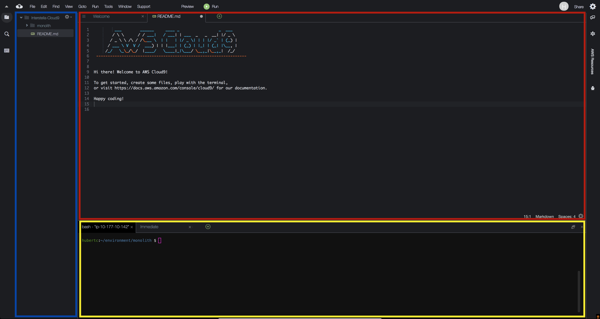

# CloudFormation Workshop
## Build your first web app with CloudFormation

## Summary
The goal of this workshop is to give users a hands on experience building CloudFormation templates. Ultimately, when all is done, users will have a working website on AWS. 

### Workshop Setup
Workshop accounts have already been created for you. Simply log into them and start the labs. You can feel free to run commands from anywhere, but a Cloud9 instance has been created for your convenience.

### Familiarize yourself with the workshop environment

1\. Access your AWS Cloud9 Development Environment

In the AWS Management Console, go to the [Cloud9 Dashboard](https://console.aws.amazon.com/cloud9/home) and find your environment which should be prefixed with the name of the CloudFormation stack you created earlier, in our case mythical-mysfits-devsecops. You can also find the name of your environment in the CloudFormation outputs as Cloud9Env. Click **Open IDE**.

2\. Familiarize yourself with the Cloud9 Environment

On the left pane (Blue), any files downloaded to your environment will appear here in the file tree. In the middle (Red) pane, any documents you open will show up here. Test this out by double clicking on README.md in the left pane and edit the file by adding some arbitrary text. Then save it by clicking **File** and **Save**. Keyboard shortcuts will work as well.

On the bottom, you will see a bash shell (Yellow). For the remainder of the lab, use this shell to enter all commands.  You can also customize your Cloud9 environment by changing themes, moving panes around, etc. As an example, you can change the theme from light to dark by following the instructions [here](https://docs.aws.amazon.com/cloud9/latest/user-guide/settings-theme.html).

### Set Up Cloud9 Environment

1\. Clone Workshop Repo

There are a number of files and startup scripts we have pre-created for you. They're all in the main repo that you're using, so we'll clone that locally. Run this:

<pre>
$ git clone https://github.com/hub714/aws-demos.git
</pre>

### Let's begin!

Now you're ready to begin! [Click here](0-create-template) to continue on.